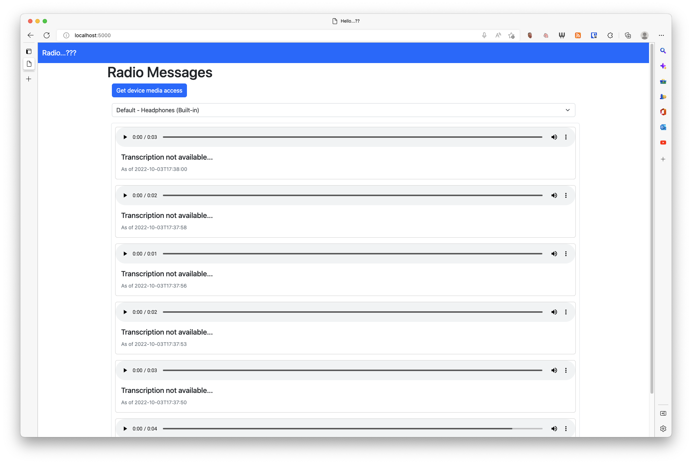

# RadioExperiments



## Current Features

* Record and playback radio messages
  * Recorded messages are stored as WAV files
  * If there is an internet connection, the WAV files are transcribed using Microsoft Azure Speech-to-Text
* Choose audio output device
  
## Planned Features

* Soundboard with pre-recorded messages to transmit
* Backup WAV files to a cloud storage service
* Public view with limited functionality

## Bundling the Web Server

Windows:

```bash
pyinstaller -w -F --add-data "templates;templates" --add-data "static;static" main.py
```

*nix:

```bash
pyinstaller -w -F --add-data "templates:templates" --add-data "static:static" main.py
```